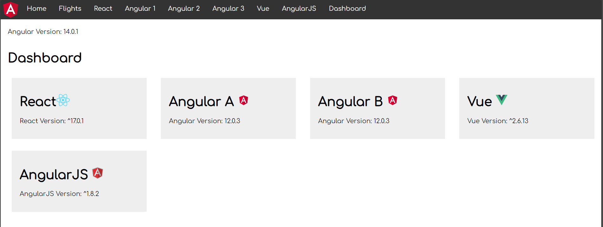

# Webpack Module Federation and multi-frameworks

- [Intro](#intro)
- [Learn how to create multi-framework apps](#learn-how-to-create-multi-framework-apps)
- [More examples of multi-framework apps](#more-examples-of-multi-framework-apps)
  - [Example 1](#example-1)
  - [Example 2](#example-2)

## Intro

There's no [code demo](/README.md#code-demos) in this repo that shows how to create a shell app that consumes micro frontends from different frameworks using Webpack Module Federation. However, if you've read through the code demos than you have almost all the required knowledge to create one. The bits that weren't covered will be framework specific such as how to extend your framework's webpack configuration file.

This document gives you information on how you can have multiple frameworks working in a single application but beware of the following alert:

> In his recent talk on [Micro Frontend Anti Patterns](https://www.youtube.com/watch?v=asXPRrg6M2Y), my friend [Luca Mezzalira](https://twitter.com/lucamezzalira) mentions using several frontend frameworks in one application.
>
>There's a good reason for considering this an anti pattern: Current frameworks are not prepared to be bootstrapped in the same browser tab together with other frameworks or other versions of themselves. Besides leading to bigger bundles, this also increases the complexity and calls for some workarounds.
However, Luca also explains that there are some situations where such an approach might be needed. He brings up the following examples: dealing with legacy systems, migration to a new UI framework/library, after merging companies with different tech stacks.[^1]

[^1]: Taken from `Pattern or Anti-Pattern?` section of [Multi-Framework and -Version Micro Frontends with Module Federation: Your 4 Steps Guide](https://www.angulararchitects.io/en/blog/multi-framework-and-version-micro-frontends-with-module-federation-your-4-steps-guide/).

## Learn how to create multi-framework apps

If you're interested in multi-framework apps and want to learn more I advise you to study the following videos:

- [Micro frontends and the multiverse of Frameworks](https://www.youtube.com/watch?v=oX7N3Pyo-T8): talk from `ng-conf 2022` for which the code is at the [adrianiskandar/ModuleFederationWebComponents](https://github.com/adrianiskandar/ModuleFederationWebComponents) repo.
- [Let's build together a microfrontends application combining multiple frameworks using Module Federation](https://www.youtube.com/watch?v=libbOCJH6pc) talk from `Devoxx Belgium 2023 Conference` for which the code can be found through the [sdedieu/snow-shop](https://github.com/sdedieu/snow-shop) repo.

And articles:

- [Micro Frontends with Modern Angular – Part 2: Multi-Version and Multi-Framework Solutions with Angular Elements and Web Components](https://www.angulararchitects.io/en/blog/micro-frontends-with-modern-angular-part-2-multi-version-and-multi-framework-solutions-with-angular-elements-and-web-components/)
- [Multi-Framework and -Version Micro Frontends with Module Federation: Your 4 Steps Guide](https://www.angulararchitects.io/en/blog/multi-framework-and-version-micro-frontends-with-module-federation-your-4-steps-guide/)
- [Multi-Framework and -Version Micro Frontends with Module Federation: The Good, the Bad, the Ugly](https://www.angulararchitects.io/en/blog/multi-framework-and-version-micro-frontends-with-module-federation-the-good-the-bad-the-ugly/)

## More examples of multi-framework apps

You can find several examples of Webpack Module Federation setups, including setups using multiple frameworks, in the [module-federation/module-federation-examples repo](https://github.com/module-federation/module-federation-examples).

For other examples see the following [Example 1](#example-1) and [Example 2](#example-2) sections.

### Example 1

The [README](https://www.npmjs.com/package/@angular-architects/module-federation-tools) for the `@angular-architects/module-federation-tools` package shows an example of how to use Webpack Module Federation in a multi-framework environment. The example can be seem live at https://red-ocean-0fe4c4610.azurestaticapps.net.

The setup includes:
- an Angular shell that loads MFEs that are in the same or different version of Angular, as well as MFEs using different frameworks such as React, Vue and AngularJS. The Angular shell contains the top navbar, as well as the content for the home and the dashboard tabs. The code for the shell is at [manfredsteyer/multi-framework-version](https://github.com/manfredsteyer/multi-framework-version). This repo also contains an `mfe1` app which is the micro-frontend for the content of the flights tab.
- A React mfe app with code at [manfredsteyer/react-app](https://github.com/manfredsteyer/react-app).
- An Angular1 mfe app with code at [manfredsteyer/angular-app1](https://github.com/manfredsteyer/angular-app1).
- An Angular2 mfe app with code at [manfredsteyer/angular-app2](https://github.com/manfredsteyer/angular-app2).
- An Angular3 mfe app with code at [manfredsteyer/angular3-app](https://github.com/manfredsteyer/angular3-app).
- A Vue mfe app with code at [manfredsteyer/vue-js](https://github.com/manfredsteyer/vue-js).
- An AngularJS mfe app with code at [manfredsteyer/angularjs-app](https://github.com/manfredsteyer/angularjs-app).

There's also a [tutorial](https://github.com/angular-architects/module-federation-plugin/blob/main/libs/mf-tools/tutorial/index.md) available for the above setup.

### Example 2

Another example of a multi-framework setup can be found at [manfredsteyer/multi-framework-micro-frontend](https://github.com/manfredsteyer/multi-framework-micro-frontend). This example contains:
- a shell in Angular 13.
- a mfe1 app in Angular 13.
- a mfe2 app in Angular 12.
- a mfe3 app in Angular 12.
- a mfe4 app in React 17.
